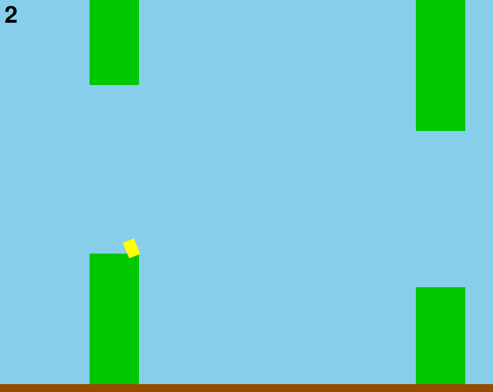

# Flappy Bird NEAT AI Bot

A small project that implements a Flappy Bird clone and trains an AI agent using the NEAT (NeuroEvolution of Augmenting Topologies) algorithm to play it.

## About

This repository contains a custom Flappy Bird implementation written in Python with a NEAT-based training pipeline. The goal is to evolve neural networks that learn to play the game across different difficulty configurations.

Key points:
- Algorithm: NEAT (neuroevolution evolving both weights and topology)
- Language: Python
- Libraries: `neat-python`, `pygame`

Source project description: see [description.md](description.md) (polish).



## Installation

1. Create and activate a virtual environment (recommended):

```bash
python -m venv .venv
source .venv/bin/activate
```

2. Install dependencies:

```bash
pip install -r requirements.txt
```

## Configuration

- Main NEAT configuration file: `config-neat.txt`
- Difficulty presets: `difficulties/` (YAML files)

Adjust population size, mutation rates and other NEAT parameters in `config-neat.txt`.

## Usage

- Run the training script:

```bash
python train.py
```

- Run the game replay / visualizer:

```bash
python replay.py  # or python game.py to run a playable instance
```

Check the `saves/` folder for trained populations and checkpoints.

## Project structure

- `bot.py`, `train.py`, `game.py`, `replay.py` — main scripts
- `config-neat.txt` — NEAT configuration
- `requirements.txt` — Python dependencies
- `src/` — game engine modules (`bird.py`, `pipe.py`, `game.py`)
- `difficulties/` — preset YAML difficulty files
- `saves/` — saved training runs

